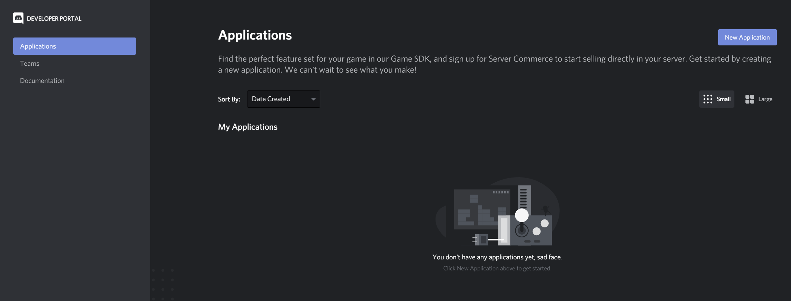
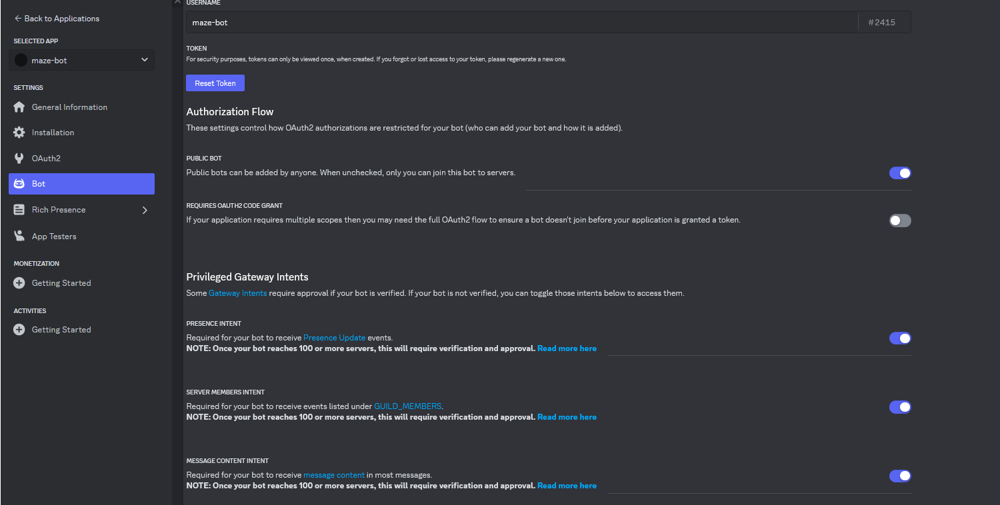
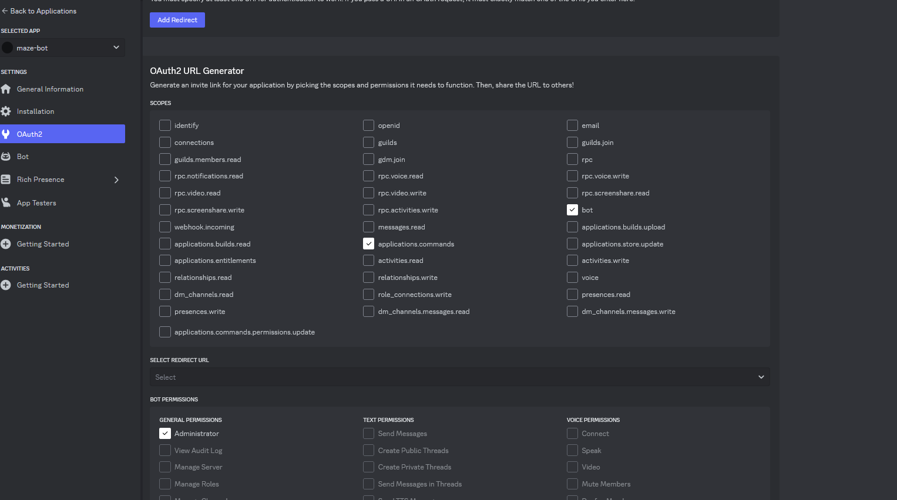

<h4 align='center'>Инструкция по созданию бота</h4>

В этом репозитории я создал discord-бота с лабиринтом. Ниже я покажу мои настройки бота и дам инструкции по созданию 
на момент мая 2024 года

    
На сайте https://discord.com/developers/applications нажимаем на New Application и вводим имя бота

    

    
Во вкладке бот кликаем штучки, указанные на картинке ниже

    

    
В OAuth2 тыкаем галку на bot, applications.commands, Administrator (указаны на картинке ниже)

    

Перейти по выданной внизу ссылке и добавить бота на сервер

pip install discord.py - установка библиотеки

